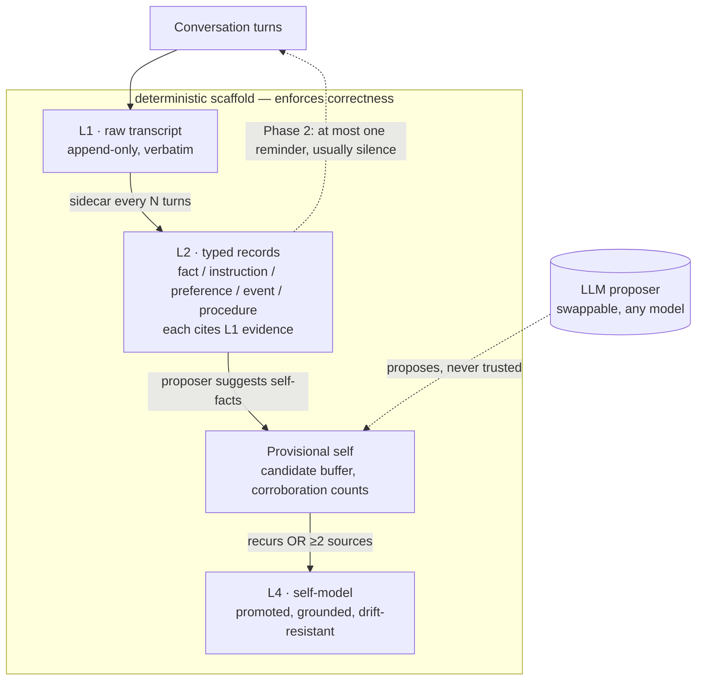

# Foundational Memory

**Correctness-by-construction memory for LLM agents — the model proposes, the scaffold disposes.**

A working, tested implementation of *memory as construction* for an autonomous agent (running here on a
Mac mini over SMS). It stores little, forgets on purpose, intervenes rarely, and — the frontier part —
**evolves a self-model that cannot confabulate, because grounding is enforced in code, not asked of the model.**

> Most agent memory makes correctness the **model's** job (trust it not to hallucinate or drift).
> This makes correctness the **architecture's** job — so the memory's integrity is *independent of the
> model that fills it*. We proved that: safety held across five proposer models, including one that emits
> garbage. Only *recall* varied.

Derived from the [*Memory as Construction* thesis](https://github.com/ianpilon/memory-as-construction-LLM-wiki)
and its [build spec](./agent-memory-spec.md). MIT licensed.

---

## The idea in one diagram



**The LLM is demoted to a swappable proposer.** It *suggests* edits; the scaffold *validates, grounds, and
gates* them. A weak — or adversarial — proposer can't corrupt memory; it can only be less productive.

---

## What's novel (and what isn't)

**Novel (defensible):**
1. **Correctness-by-construction self-model evolution, shown model-agnostic.** Ungrounded self-claims are
   rejected *in code*; we demonstrated the safety guarantee is proposer-independent with a 5-model sweep.
2. **A "provisional self" with corroboration-gated promotion** — a concrete anti-drift mechanism (claims must
   recur or be multiply-sourced before becoming canon).
3. **Silence as a first-class, logged decision** — the memory records *when it chose not to intervene*.

**Built on (not ours):** memory-as-construction (Conway/Levin et al.); intervention-with-silence
(Proactive Memory Agent); navigation-as-action (NapMem); self-editing memory via tools (MemGPT/Letta);
reflection (Generative Agents); typed records + provenance (KG-memory, e.g. Zep/Graphiti); execution-grounded
skills (Voyager). **Nearly every mechanism has precedent — the contribution is the synthesis + two hardening
moves (code-enforced grounding, corroboration-gated promotion) + one empirical result.**

Full write-up: **[NOVELTY.md](./NOVELTY.md)**.

---

## Evidence

**Invariant QA — 26/26** ([`tests/qa_self_model.py`](./tests/qa_self_model.py)): ungrounded claim rejected in
code; corroboration gating (single-source held / breadth promotes / recurrence promotes); garbage-in doesn't
crash; kill-switch; hand-written self-model never overwritten; full provenance chain intact; **evidence-cited
records are un-forgettable, and forgetting is a reversible, L1-preserving, logged tombstone**; **the
user-commanded `memory_forget` tool previews before forgetting, refuses self-model-critical records unless the
user explicitly forces it, and reports any belief it leaves unsupported** (see *Forgetting discipline* below).

**Agnosticism sweep** ([`tests/agnosticism_sweep.py`](./tests/agnosticism_sweep.py)) — identical self-model pass
across 5 local models × 2 samples on identical records:

| proposer | recall | memory leaks | ungrounded caught by scaffold |
|---|---|---|---|
| qwen2.5:7b | 100% | **0** | 0 |
| gemma3:4b (3.3 GB) | 100% | **0** | 0 |
| gemma4:e4b (9.6 GB) | 100% | **0** | 0 |
| hermes3:8b | 50% | **0** | **1 — guard fired on a real model** |
| nemotron-8b (can't format) | 0% | **0** | 0 |

**Safety = 0 leaks across every model** (scaffold-enforced). **Recall = 0–100%, and not by model size**
(smallest tied largest; the agentic model lagged both). The floor case (nemotron): a useless proposer, still 0 leaks.

---

## Forgetting discipline (2026-07-15)

Forgetting is part of *memory as construction*, not a violation of it — the spec names it (§3,
`memory_delete`). But the original `_delete_records` did it the wrong way: it let the **proposer dispose**.
On a hard rewrite of `records.jsonl`, a weak proposer (our local qwen) could drop a record with **no reason,
no log, and — critically — no protection for records that a promoted self-fact cites as evidence.** That last
one can silently sever the `self-fact → L2 record → L1 turn` chain this whole system claims is *impossible by
construction*. Auditing the live bank, we found the path had already fired (1 of 4 cycles deleted a record,
`reason: null`) during the exact cycle the agent settled on the name **"Pal"** — one record away from
un-grounding its own identity. The chain held by luck, not by construction.

**The fix makes forgetting obey the same "scaffold disposes" rule as everything else:**

- **L1 is untouchable.** Forgetting only ever reshapes the constructed layer (L2). `raw.jsonl` — the ground
  truth anything can be rebuilt from — is never rewritten. So a forget is *reconstruction of the working set*,
  not destruction.
- **Tombstone, not hard-drop.** A forgotten record is marked (`forgotten: {ts, reason}`) and withheld from the
  working set (search / recent / retrieval / self-model evidence) but retained on disk — reversible and auditable.
- **Provenance is un-forgettable.** The scaffold refuses to forget any record cited as self-model evidence
  (`_cited_record_ids`). The proposer may *ask*; the scaffold *decides*. This is the guarantee, enforced.
- **Forgetting is observable, like silence.** The reason and any refusals now flow into the decision log
  (`cycles.jsonl`) — closing the gap where we logged *why memory stayed silent* but not *why it forgot*.

Proven by two invariants (TF1: evidence-cited records are refused forgetting; TF2: forgetting is a
reversible, L1-preserving, logged tombstone).

**Autonomous vs. commanded forgetting.** The above governs the *autonomous* sidecar — qwen deciding on its own,
every `cycle_interval` turns. That cadence is deliberate: forgetting is consolidation (retrospective, not
time-sensitive), and running the riskiest proposer operation *less* often is a feature. But a user saying
"forget the card number I gave you" should be honored *immediately*, not left to the sidecar — so that case gets
its own explicit tool, **`memory_forget`**, callable by the action agent (Pal) on the user's behalf:

- **Two steps: preview → commit.** Called with a `query`, it *previews* matching records and forgets nothing —
  Pal shows the user what matched and confirms. Called with `ids`, it commits the forget. This stops a fuzzy
  match from nuking the wrong record.
- **Same guard, reused.** A commanded forget runs through the identical `_forget_records` path — reversible
  tombstone, L1 untouched, logged (as a `user_forget` event).
- **User authority, with a brake.** Self-model-critical records (cited as evidence) are flagged in the preview
  and *refused* on commit — unless the user explicitly confirms and Pal passes `force=true`. The user has
  authority the autonomous proposer does not, but forcing it still tombstones (reversible) and **reports which
  belief it left unsupported** — you can't keep "I am Pal" once you've erased every reason you had for it.

Proven by TF3 (preview forgets nothing, flags critical records), TF4 (commanded forget is a logged, reversible
tombstone), TF5 (commit refuses critical records without force; force honors the override and reports the
now-unsupported belief).

> **Inspiration — [Sanna](https://github.com/sanna-ai).** The lens came from Sanna, an open-source governance
> layer for AI agents: *gate risky actions at the boundary before they execute, and make every governance
> decision observable.* Applying that lens to our forget path is what surfaced the un-grounding hole. We took
> the **idea**, not the machinery — Sanna's signed "constitution" files and Ed25519 receipts are built to prove
> good behavior to *third parties who don't trust you*; a single-user agent on your own Mac mini has no such
> party, so that overhead isn't warranted here. The governance simply became one more invariant in the scaffold
> that was already disposing everything else.

---

## Quickstart

Assumes a working agent host with a local model runner (Ollama) and a memory-role model (default `qwen2.5:7b`).

```bash
# install the memory provider
./install.sh                 # copies the plugin, seeds the self-model, flips memory.provider, verifies

# prove the properties
HERMES_HOME=~/.hermes python3 tests/qa_self_model.py          # 26/26 invariants
HERMES_HOME=~/.hermes python3 tests/agnosticism_sweep.py      # the model-agnosticism sweep

# optional: live viewer (browser dashboard of the bank + decision log)
cd viewer && ./install-viewer.sh
```

See **[PLAYBOOK.md](./PLAYBOOK.md)** for the full per-machine procedure, rollback, and fleet notes.

---

## Repository layout

```
plugins/foundational/     the memory provider (storage, sidecar, intervention, self-model evolution)
tests/                    qa_self_model.py (invariants) · agnosticism_sweep.py (model-agnosticism)
viewer/                   app.py + app.html — password-protected, on-demand live dashboard
install.sh · verify.py    provider installer + deep verifier
PLAYBOOK.md               per-machine install / rollback / fleet guide
NOVELTY.md                one-page contribution brief (novel / prior art / evidence / limitations)
agent-memory-spec.md      the build spec this implements
```

---

## Limitations (stated plainly)

- This does **not** "solve" co-emergent self-models — it's a disciplined, tested implementation of the hardest layer.
- Working system + **small study** (2 samples × 5 models, one machine) — **not** a peer-reviewed benchmark, and
  **not** a head-to-head vs Generative Agents / MemGPT.
- We proved **safety** is model-agnostic; we did **not** prove *quality* is — recall is model-limited.
- L3 (topic tracks) is unbuilt; the self-model proposer is currently local-only (a cloud-model proposer is the next step).
- Not every "build now" item from the spec is fully built: **salience scoring** is still a neutral stub (records carry
  placeholder `valence/arousal` fields, no classifier yet), and L2 reconciliation is minimal dedup. So this leapt ahead
  to the hardest stubbed layer (the self-model) while leaving a couple of shippable items stubbed.
- **Tombstones grow `records.jsonl` monotonically** (forgetting retains, never erases). The right trade for a
  single-machine agent where auditability beats bytes; if it ever matters, compact old tombstones into a separate
  `forgotten.jsonl` — never by hard-deleting them.

---

## License

MIT — see [LICENSE](./LICENSE). Derived by Ian Pilon from the *Memory as Construction* thesis.
